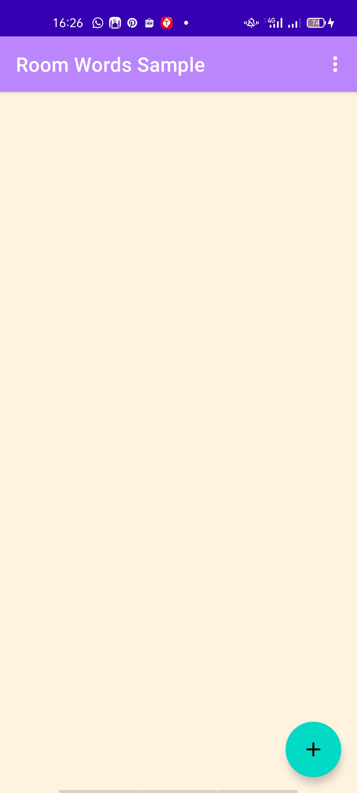
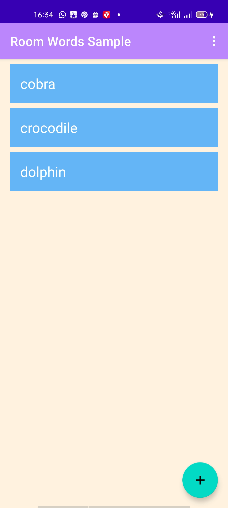
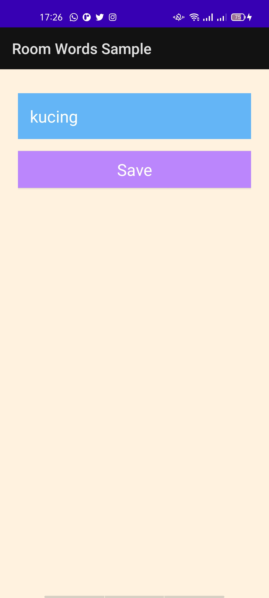
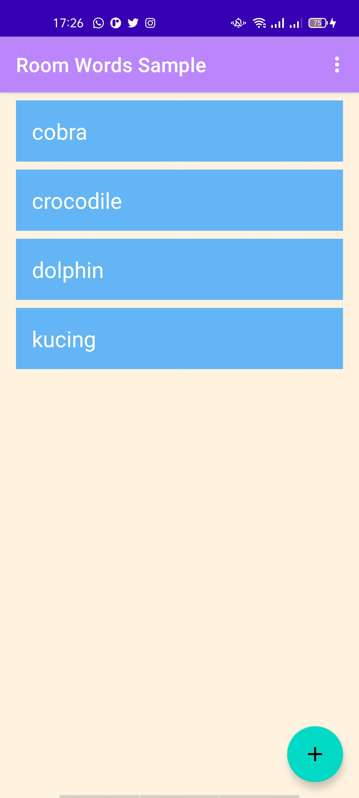
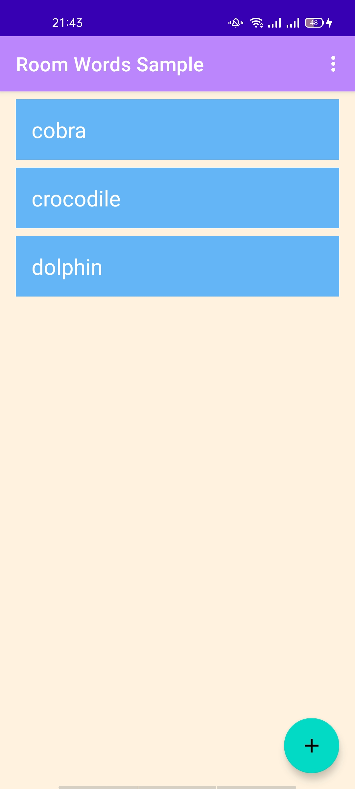
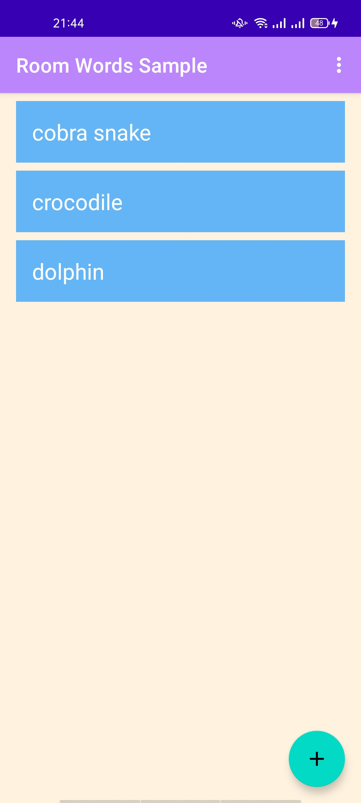
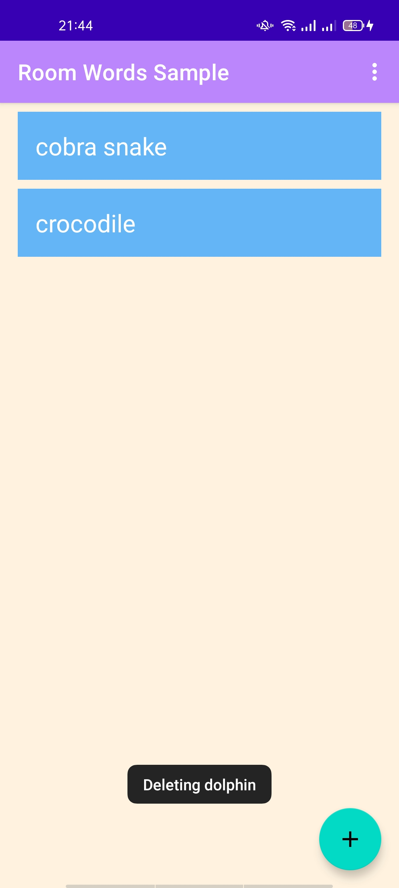

# Android fundamentals 10.1 Part A: Room, LiveData, and ViewModel

    Nama  : Adika Ahmad Hanif Nazhir  
    Kelas : TI 3B  
    NIM   : 2041720171

## Praktikum
### Blank Space (Task 9)

### UI Data (Task 11)

### Add Words (Task 12)

# Homework
### Layout

### Edit the word "cobra"

### Delete the word "dolphin"

